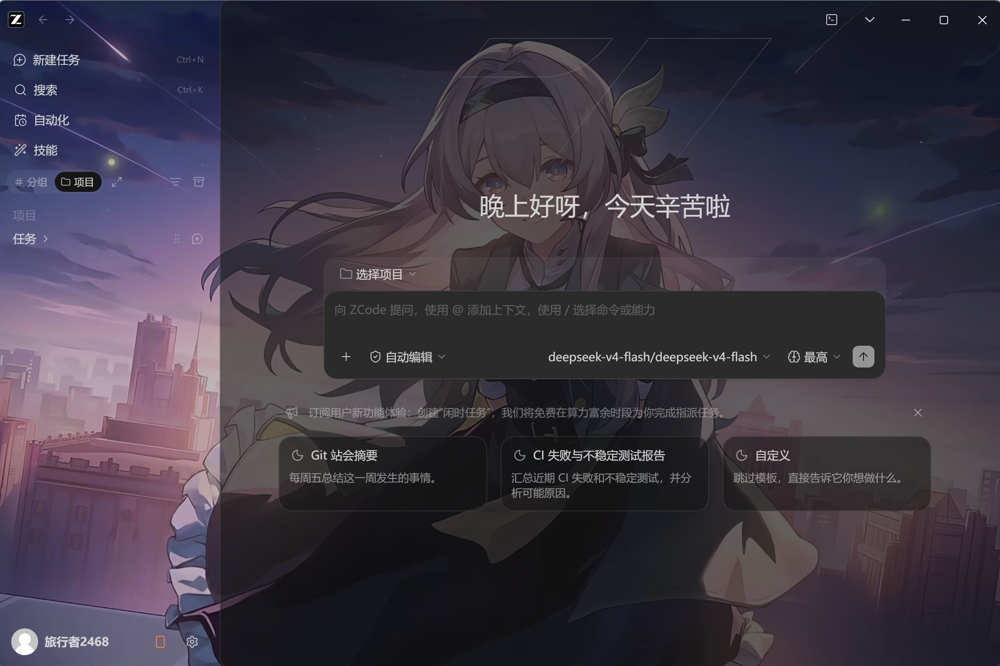

# ZCode 壁纸启动器（Zcode-Wallpaper）

近期高强度使用Zcode，正好流萤手办到了，想着换上个流萤壁纸给Zcode，所以vibe了一个壁纸启动器。
功能：给 **ZCode 桌面客户端**（智谱 AI / Z.ai 的 Electron 开发应用）加**壁纸**：选一张**图片**（PNG/JPG/GIF/WebP 等）或**视频**（MP4/WebM/MOV 等，动态壁纸）作为 ZCode 背景。

## 目录结构

```
Zcode-Wallpaper/
├── app/                    # 应用代码（全部 Python + 注入脚本）
│   ├── __init__.py
│   ├── main.py             # 启动器 GUI / CLI
│   ├── controller.py       # CDP 控制器
│   ├── wsclient.py         # 最小 WebSocket 客户端
│   ├── config.py           # 共享配置
│   └── inject/wallpaper.js # 注入到渲染进程的壁纸脚本
├── assets/demo_wallpaper.png   # 演示壁纸
├── config.json             # 运行时配置（本机，不入库）
├── config.example.json     # 配置模板
├── run.bat                 # Windows 一键启动 GUI
├── auto_start.bat          # 桌面快捷方式入口：自动带壁纸启动 ZCode
└── README.md
```

## 使用

> 所有命令在**项目根目录**执行。

### 首次使用

```bash
# 若没有 config.json，复制模板（或直接运行 GUI，未配置时会用演示壁纸）
copy config.example.json config.json
```

### 方式一：GUI（推荐）

```bash
python app/main.py
# 或双击 run.bat
```

1. 点「浏览…」选择一张**图片**（PNG/JPG/BMP/GIF/WebP）或**视频**（MP4/WebM/MOV 等，作为动态壁纸）。
2. 确认 ZCode 程序路径已自动填入（`C:\Study\Zcode\ZCode.exe`）。
3. 调整「样式模式 / 图片位置 / 暗化」。
4. 点 **「启动/重启 ZCode（带壁纸）」**。若 ZCode 正在运行，会先结束再带壁纸启动。
5. 界面可随时关闭，壁纸保持生效（控制器独立常驻，日志 `controller.log`）。

> 注意：壁纸生效的前提是 ZCode 由本启动器启动（自动带调试端口）。直接双击 `ZCode.exe` 不会注入壁纸。

### 方式二：命令行

```bash
python app/main.py --cli launch      # 结束已运行的 ZCode → 带壁纸重启（前台阻塞运行）
python app/main.py --auto-start      # 桌面快捷方式入口：自动带壁纸启动（后台常驻）
python app/controller.py             # 仅启动控制器（附加/拉起 ZCode）
python app/controller.py --attach    # 只附加已开的调试实例，不启动 ZCode
python app/controller.py --probe     # 探测页面 DOM（用于调整透明化选择器）
python app/controller.py --shot x.png  # 注入后截图（调试用）
```

### 桌面快捷方式自动带壁纸启动

本项目会把 ZCode 的**桌面/开始菜单快捷方式**改为**直接指向 `pythonw.exe app\main.py --auto-start`**（已备份原快捷方式为 `.lnk.bak`），这样**直接双击 ZCode 图标也会自动加载你保存的壁纸**，而且全程无控制台黑框：

- `--auto-start` 复用启动器同款流程：结束已在运行的 ZCode（确保调试端口生效）→ 清理旧控制器 → 后台启动控制器 → ZCode 带调试端口拉起并注入 `config.json` 里保存的壁纸。
- 所有内部 `tasklist / taskkill / powershell` 子进程都带 `CREATE_NO_WINDOW`，不会弹出 cmd 黑框（`auto_start.bat` 作为手动替代入口仍保留在仓库里）。

注意事项：
- 若 ZCode 已在运行，点击快捷方式会**先结束再重启**（调试端口只能在启动时打开）。
- ZCode 升级若重建了快捷方式，需要重新执行一次快捷方式修改（原 `.lnk.bak` 可直接还原；把新的快捷方式目标指回 `pythonw.exe` + `app\main.py --auto-start` 即可）。项目本身的定制文件不受升级影响。

## 配置（config.json）

| 字段 | 说明 | 默认 |
|---|---|---|
| `zcode_path` | ZCode.exe 路径 | `C:\Study\Zcode\ZCode.exe` |
| `wallpaper` | 壁纸路径（图片或视频，相对项目根也行；按扩展名自动识别，`mp4/webm/mov/m4v/mkv/avi` 走动态壁纸） | `assets/demo_wallpaper.png` |
| `port` | CDP 调试端口 | `9333` |
| `image_port` | 本地图片服务端口 | `18765` |
| `mode` | `cover` / `contain` / `fill` / `tile` | `cover` |
| `position` | 图片对齐 | `center` |
| `darken` | 0~0.9 暗化蒙层，保证文字可读 | `0.25` |
| `transparent_selectors` | 设为 `background:transparent!important` 的 CSS 选择器列表 | `[".bg-background-win-alt"]` |
| `background_overrides` | 高级：`选择器 → background 值`（如让主内容卡片半透明） | 见下 |

默认的“整窗壁纸 + 内容区半透明（含设置/自动化等各页面）”效果：

```json
{
  "transparent_selectors": [".bg-background-win-alt"],
  "background_overrides": {
    "section.bg-background": "--color-background: rgba(22, 22, 22, 0.55)",
    "div.bg-background": "rgba(22, 22, 22, 0.55)",
    "main#automations-main-toast-anchor": "rgba(22, 22, 22, 0.55)"
  }
}
```

- 第一条把主内容卡片的 `--color-background` 变量改为半透明，**所有嵌套使用 `bg-background` 的页面容器（设置、自动化等）都会自动透出壁纸**，无需逐页配置；后两条是显式兜底。
- 选择器**不要绑定圆角类名**（`rounded-xl` / `rounded-none` / `rounded-[5px]` …）：ZCode 每次升级都可能换一个（3.7.x 是 `rounded-xl`，最大化时 `rounded-none`，3.12.3 改成 `rounded-[5px]`），绑死就会整条规则静默失效、右侧内容区被不透明卡片盖住。用 `section.bg-background` 这种「标签 + `bg-background`」的写法，圆角怎么变都能命中。
- `background_overrides` 的值若不含 `:` 则按 `background` 处理；若含 `:` 则按自定义 CSS 声明处理（多条用 `;` 分隔，各加 `!important`）。
- 想让壁纸只出现在侧栏/边框、内容区保持不透明：把 `background_overrides` 改为 `{}`（此时**不会**触发下面的兜底自愈）。
- **兜底自愈**：如果 `background_overrides` 里的选择器在当前版本一个都没命中（升级改了类名），注入脚本会自动把「面积够大且不透明的 `bg-background` 表面」按同样的半透明值处理，保证壁纸不会整块被盖住；弹层/菜单不受影响。同时会把情况写进 `controller.log`（`[injector] 注意：…未命中，已自动把 N 个内容表面改为半透明兜底`），并可用 `--probe` 查看 `diag=` 一行。兜底只保证「看得见壁纸」，想恢复逐页精致的透明效果，还是照新版 DOM 更新选择器。

**运行中改 `config.json`（或 GUI 重新保存）会自动生效**（控制器每 3 秒检测一次），无需重启 ZCode。

> 说明：GUI 保存时**以磁盘上最新的 config.json 为基底合并**，只覆盖 GUI 里能改的字段，因此手工加进 `background_overrides` 等高级规则不会因 GUI 保存而丢失。控制器每隔几秒会**全量重注入**壁纸脚本，即使页面被旧配置污染也会自动恢复；注入脚本的 `apply()` 是**幂等**的（内容不变就不改动任何 DOM），因此周期性心跳不会造成闪屏。若更新了 `main.py`，请重启 GUI 再保存。

**控制器是单实例的**：通过 `controller.lock` 锁 + 固定图片端口绑定保证同时只有一个控制器运行；GUI 每次启动前会先清理旧的控制器进程。避免多控制器互相覆盖注入导致壁纸 URL 在多个端口间跳变而闪屏。

## 常见问题

- **壁纸没生效？** 确认 ZCode 是本启动器启动的（`controller.log` 有 `已注入 N 个页面`）；检查 `config.json` 的 `wallpaper` 路径存在。
- **壁纸只在侧栏显示、右侧内容区被一块深色面板盖住？** ZCode 升级换了内部类名，导致 `background_overrides` 的选择器不再命中。新版注入脚本会自动兜底（日志里有 `未命中，已自动把 N 个内容表面改为半透明兜底`），照提示用 `--probe` 更新选择器即可彻底修好。
- **端口被占用？** 改 `port`；或先 `taskkill /IM ZCode.exe /F /T` 再启动。
- **想恢复原样？** 结束 ZCode，用官方方式启动即可（本项目不写入 ZCode 任何文件）。

## 升级说明

ZCode 升级（自动更新或手动安装）会整体替换 `C:\Study\Zcode\*`，本项目的定制文件都在项目目录，升级后仍通过启动器注入壁纸，无需重装。若升级改变了渲染 DOM 结构（典型症状：右侧内容区整块盖住壁纸），注入脚本会自动兜底半透明化并在 `controller.log` 里提示；要恢复完整效果，用 `--probe` 探查后更新 `config.json` 里的 `transparent_selectors` / `background_overrides`。

## 免责声明

本工具仅在本机对 ZCode 做视觉定制（壁纸），通过官方 DevTools 协议注入，不改动应用文件、不上传任何数据。
